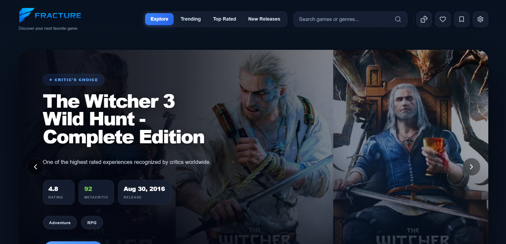
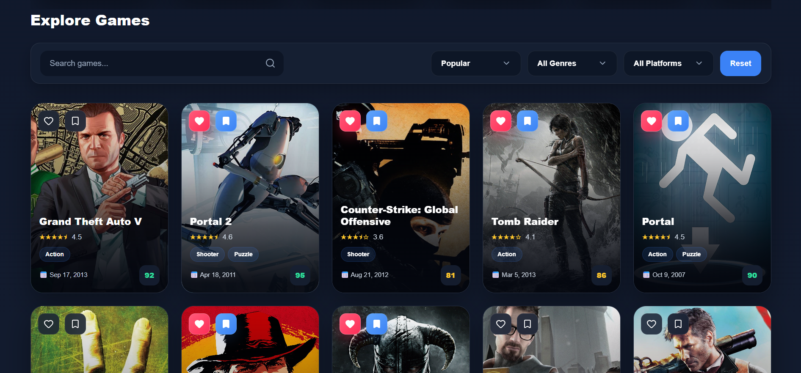
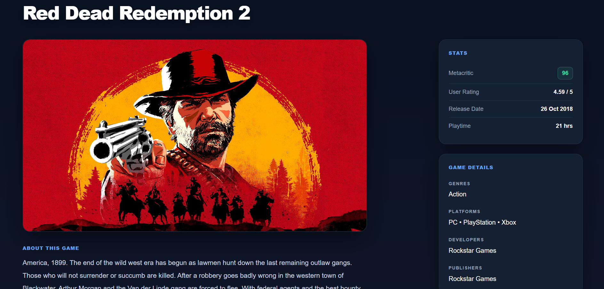
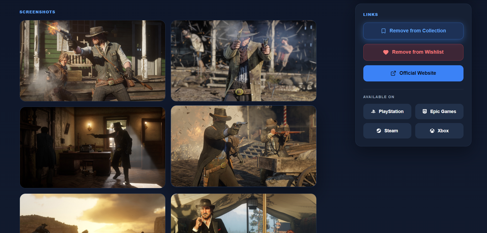
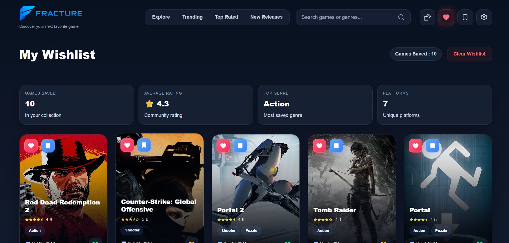
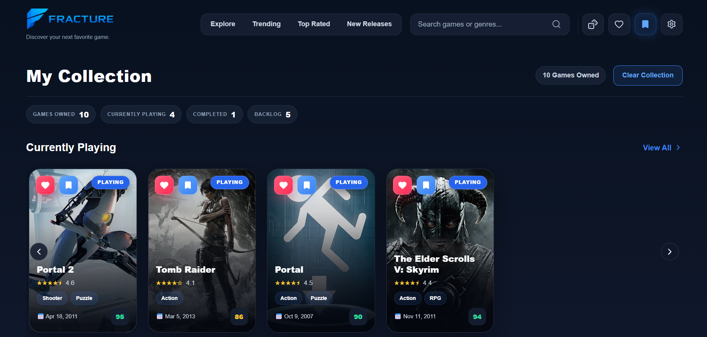
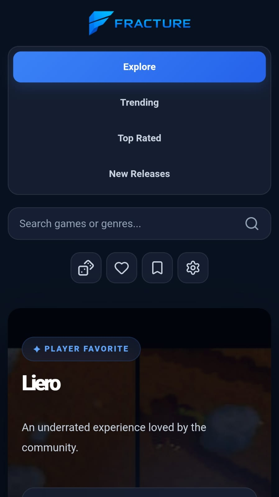

# 🎮 FRACTURE

> A cinematic full-stack game discovery platform built with **React, Express, and the RAWG Video Games Database API**.

FRACTURE is a modern game exploration platform designed to help players discover, search, and organize games through a premium storefront-inspired experience.

Built with a focus on immersive UI, clean architecture, secure API handling, and a smooth discovery workflow inspired by modern gaming platforms.

---

## 🌐 Live Demo

🚀 https://fracture-seven.vercel.app/

---

# 📸 Preview

## Homepage

Cinematic hero experience featuring dynamic game discovery and immersive visuals.



---

## Game Discovery

Explore thousands of games with search, filtering, sorting, and pagination.



---

## Game Details

Detailed game pages with information, ratings, platforms, screenshots, and media.



---

## Media Experience

Browse trailers and screenshots for a richer game discovery experience.



---

## Wishlist

Save games you want to explore later with persistent local storage.



---

## Library

Manage your personal collection with different game statuses.



---

## Mobile Experience

Responsive layouts optimized across different screen sizes.



---

# ✨ Features

## 🎮 Discovery Experience

- Cinematic featured game hero
- Dynamic game discovery experience
- Browse thousands of games
- Smart search with autocomplete
- Search result ranking system
- Genre filtering
- Platform filtering
- Sorting by popularity, rating, and release date
- Pagination system

---

## 📖 Game Details

- Dedicated game detail pages
- Release information
- Ratings and metadata
- Supported platforms
- Screenshot gallery
- Trailer integration
- Similar games discovery

---

## ❤️ Personal Collection

- Wishlist system
- Personal game library
- Game status management
- Persistent local storage

---

## ⚡ User Experience

- Responsive design
- Premium dark gaming aesthetic
- Glassmorphism-inspired UI
- Loading skeletons
- Toast notifications
- Error handling
- Smooth interactions and animations

---

# 🏗️ Architecture

FRACTURE uses a separated frontend and backend architecture.

```
                    User
                      |
                      |
                  Vercel
                      |
              React + Vite
              Frontend App
                      |
                      |
                 Railway
                      |
             Express Backend API
                      |
                      |
          RAWG Video Games Database API
```

### Why this architecture?

The Express backend acts as a secure API layer between the frontend and RAWG.

It handles external API communication while keeping sensitive configuration private.

Benefits:

- API keys remain hidden from the client
- Centralized API communication
- Better request management
- Cleaner frontend architecture
- Easier future expansion

---

# 🛠️ Tech Stack

## Frontend

| Technology   | Purpose                    |
| ------------ | -------------------------- |
| React 19     | UI development             |
| Vite         | Build tooling              |
| React Router | Client-side routing        |
| Context API  | Global state management    |
| Custom Hooks | Reusable application logic |
| Vanilla CSS  | Custom design system       |
| Lucide React | Interface icons            |

---

## Backend

| Technology            | Purpose                     |
| --------------------- | --------------------------- |
| Node.js               | Runtime environment         |
| Express.js            | API server                  |
| REST API              | Client-server communication |
| CORS                  | Cross-origin handling       |
| Environment Variables | Secure configuration        |

---

## External Services

| Service  | Purpose            |
| -------- | ------------------ |
| RAWG API | Game data provider |

---

## Deployment

| Service | Usage            |
| ------- | ---------------- |
| Vercel  | Frontend hosting |
| Railway | Backend hosting  |

---

# ⚙️ Engineering Highlights

## 🔐 API Security

The RAWG API key is never exposed in the frontend.

All external API communication happens through the Express backend proxy layer.

---

## ⚡ Performance Optimization

Implemented:

- Frontend API caching
- Backend response caching
- Duplicate request prevention
- Optimized API calls

---

## 🧩 Application Design

The project follows a modular architecture using:

- Reusable React components
- Custom hooks for business logic
- Context-based global state
- Dedicated API service layers
- Separated backend services

---

# 🚀 Getting Started

## Prerequisites

Install:

- Node.js
- npm

---

## Clone Repository

```bash
git clone https://github.com/vinit0749/FRACTURE.git

cd FRACTURE
```

---

# 📦 Installation

## Frontend

Install dependencies:

```bash
npm install
```

---

## Backend

Navigate to backend:

```bash
cd backend
```

Install dependencies:

```bash
npm install
```

---

# 🔑 Environment Variables

## Frontend

Create a `.env` file in the project root:

```env
VITE_API_BASE_URL=http://localhost:5000/api
```

---

## Backend

Create a `.env` file inside the backend folder:

```env
RAWG_API_KEY=your_rawg_api_key

ALLOWED_ORIGINS=http://localhost:5173
```

---

# ▶️ Running Locally

## Start Backend

Inside the backend folder:

```bash
npm start
```

Backend runs on:

```
http://localhost:5000
```

---

## Start Frontend

Inside the project root:

```bash
npm run dev
```

Frontend runs on:

```
http://localhost:5173
```

---

# 🚢 Deployment

FRACTURE is deployed using an independent frontend and backend production architecture.

```
              User
                |
                |
             Vercel
                |
        React Frontend
                |
                |
            Railway
                |
        Express Backend
                |
                |
             RAWG API
```

This allows independent deployment while keeping sensitive configuration secure.

---

# 🔮 Future Improvements

Planned improvements:

- AI-powered game recommendations
- User authentication
- Cloud-synced libraries
- Recently viewed games
- Personalized discovery system
- Advanced recommendation algorithms
- Additional UI animations and interactions

---

# 🤝 Contributing

This project is currently maintained as a personal portfolio project.

Suggestions and feedback are welcome.

---

# 📄 License

This project is licensed under the MIT License.

---

# 👤 Author

**Vinit Gohil**

Built with React, Express, and a focus on creating immersive digital experiences.
