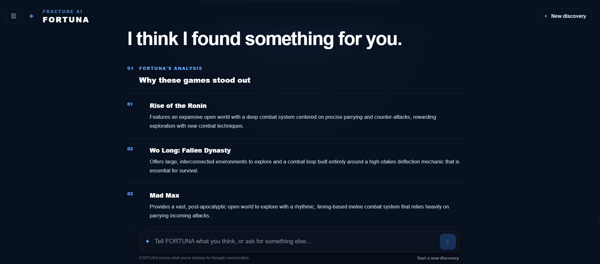

# 🎮 FRACTURE

> A cinematic game discovery platform built to make finding your next game feel like an experience.

[](https://fracture-seven.vercel.app/)

FRACTURE is a full-stack game discovery platform where players can explore, search, organize, and discover games through a cinematic, storefront-inspired interface.

Built with React, Node.js, MongoDB, and IGDB, with **FORTUNA** — an AI-powered game discovery assistant — at its core.

---

## 📸 Preview

### Home


### Explore


### Game Details


### FORTUNA



### Media


### Library


### Wishlist


### Mobile


---

## ✨ Features

- 🎮 Discover and explore thousands of games
- 🔎 Search with autocomplete, filtering, sorting, and pagination
- 📖 Detailed game pages with screenshots, trailers, ratings, platforms, and similar games
- ❤️ Wishlist and personal game library
- 👤 User authentication and profiles
- ☁️ Cloud-synced user data and profile images
- ✦ **FORTUNA** — AI-powered conversational game discovery
- 📱 Responsive experience across desktop and mobile

---

## 🛠️ Built With

### Frontend

React · Vite · React Router · Context API · Custom Hooks · Vanilla CSS

### Backend

Node.js · Express · MongoDB · Mongoose · Firebase Authentication

### Services

IGDB · Gemini · Cloudinary · YouTube

### Deployment

Vercel · Railway

---

## 🚀 Getting Started

### Prerequisites

- Node.js
- npm
- MongoDB
- Required API credentials

### Installation

Clone the repository:

```bash
git clone https://github.com/vinit0749/FRACTURE.git
cd FRACTURE
```

Install frontend dependencies:

```bash
npm install
```

Install backend dependencies:

```bash
cd backend
npm install
```

Create the required environment files using the provided `.env.example` files.

### Run the Backend

```bash
npm start
```

### Run the Frontend

From the project root:

```bash
npm run dev
```

---

## 🌐 Live Demo

**[Open FRACTURE](https://fracture-seven.vercel.app/)**

---

## 👤 Author

**Vinit Gohil**

Computer Engineering · Full-Stack Web Developer

---

## 📄 License

MIT
